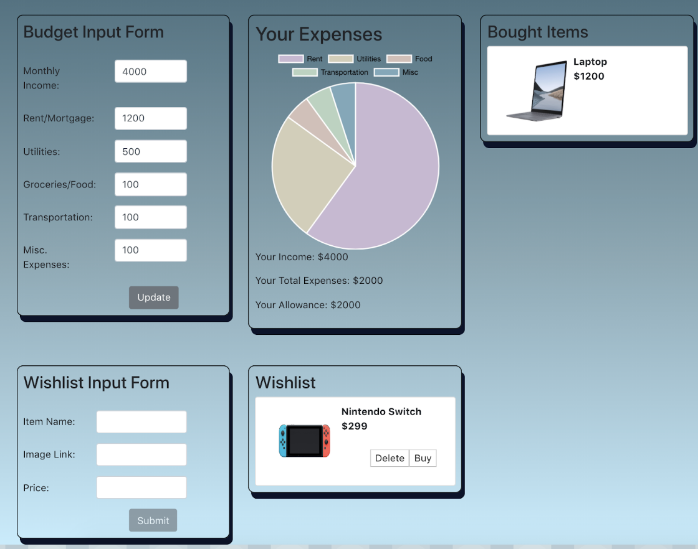
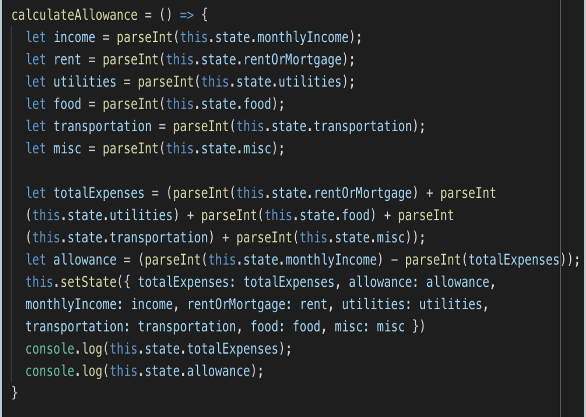
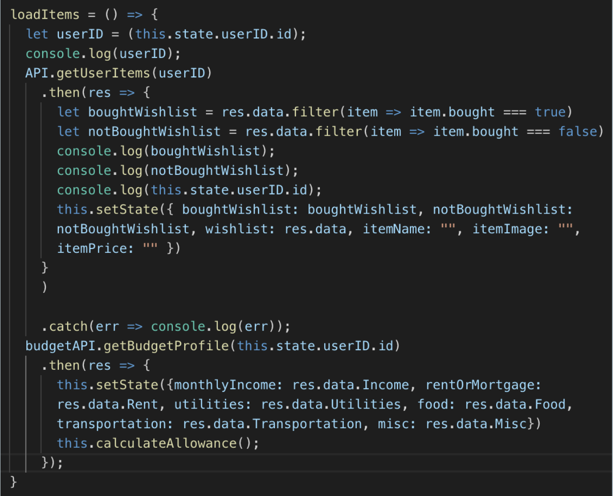

# Project-Three-New
* An app built with React

## App Screen-Shots:

## Link to full app demo on Heroku:
https://can-i-buy-this-oli.herokuapp.com/

## About the project:

We want to create a tool to not only help users track their monthly budgets but also track to see if/when they can afford to purchase an item they put in their wishlist. Users will be able to update and display all of these aspects in an intuitive way based off of user inputs.

## User Guide:

## MVP Objectives:

1. User can track income and expenses for the month.
2. User can see how much leisure money they have to spend.
3. User can create a list of items and things they want.
4. User can visualize their budgeting and saving goals and see which items they can afford this month.
5. User can see past items they have purchased.
6. User can track my progress and see just how much saving money has been able to help them purchase items they wanted.

## Stretch Goals:

1. A real-time, dynamically generating pie chart.

## Techology Stack:
  * HTML
  * CSS
  * BootStrap
  * ReactStrap
  * JavaScript
  * React
  * Node.js
  * npm express
  * MySQL
  * Sequelize
  * Heroku
  * Chart.js
  * Three.js
  * Axios

## Methodology:

The three of us mainly pair programmed the entire project so that we all could leverage each others strengths and we all understood every aspect of the app.

Our process was as follows:

Step 1: Brainstorm Ideas
Step 2: WireFrame out our ideas
Step 2: Create React app, Set up Server, Make all relevant Components
Step 3: Develop Models, Controllers, API Routes
Step 4: Set Up Database
Step 5: WORK on Backend
Step 6: Polish up our Look and Feel.

## Problems We Overcame:

1. Unfortunately Chart.js when using pie charts doesn’t do well with negative values. So we did this work around to be able to calculate users personal allowance once they have updated their budgets. Code snippet below.

2. We used the filter method to designate where a wishlist item should append, either in the wishlist or in the bought item list. Because the budget data was being dynamically updated, it would reset upon logout/page reload. We then set the budget state within our load data function using a budget API call. Code snippet below.

## Code Snippets:

For Problem 1 reference above:

For Problem 2 reference above:

## Team Members:
  1. Jerry Dudham
  2. Raj Sodhi
  3. Oliver Sun

